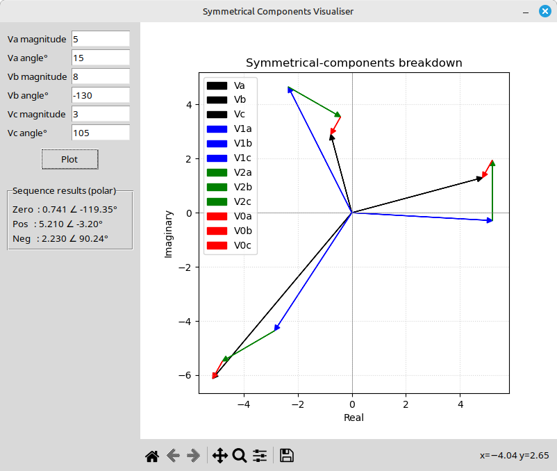

## Symmetrical-Components Visualiser  
**Language / Stack**: Python 3 – Tkinter – Matplotlib – NumPy  
**License**: MIT (feel free to change)

---

## What it does
Feed the program three arbitrary phase voltages (or any phasor set) as **magnitude & angle pairs**.  
It instantly:

1.  Calculates the **zero-, positive- and negative-sequence** components with the classical Fortescue transform.
2.  Draws a **strictly-square vector diagram** that shows:
    - Original phasors (black)  
    - Positive-sequence set (blue) – starting at origin  
    - Negative-sequence set (green) – appended head-to-tail to the positive vectors  
    - Zero-sequence vector (red) – appended to the end of each negative vector  
3.  Displays the **numerical result** for every sequence in polar form (mag ∠ °) below the input panel.
4.  Embeds the **full Matplotlib navigation toolbar** (Save, Zoom, Pan, Home, …) so the figure can be exported to PNG/SVG/PDF or inspected interactively.

---

## Why it’s handy
-  No commercial software needed – runs everywhere Python runs.  
-  100 % GUI: no command-line typing, input validation blocks non-numeric keys, pop-ups warn about empty fields.  
-  1-file deployment – perfect for students, field engineers, or quick lab checks.

---

## Contribute
PRs welcome: dark-mode, sequence-display by choice, copy-to-clipboard, auto-unit choice…

